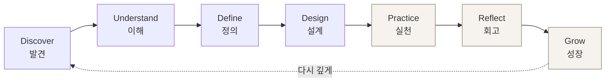
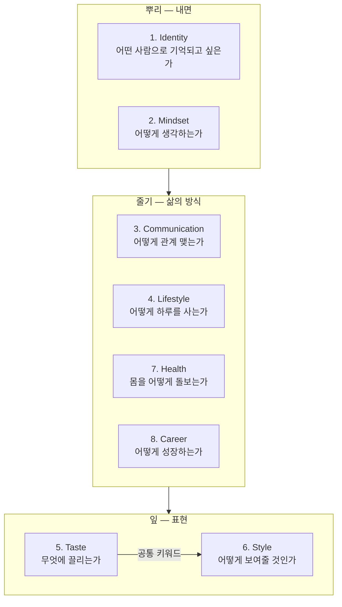
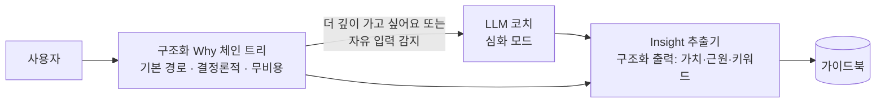
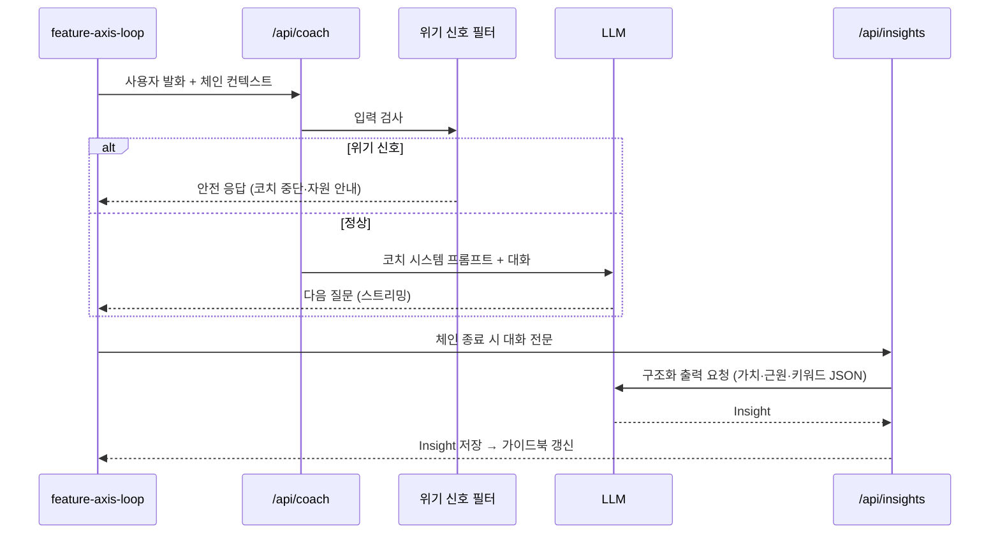

# Identity OS — 제품 설계 문서

> **추구미를 통해 나를 발견하는 자기 이해 플랫폼.**
> 사람들은 '추구미를 찾으러' 들어와서, '나를 발견하고' 돌아간다.

**이 문서의 전제 (설계 결정)**

- 기존 **'추구미' 프로젝트는 Identity OS의 진입 퍼널(Discover 모듈)로 흡수**한다. "정은채 같은 스타일을 갖고 싶다"로 들어온 사용자를 "나는 차분함과 지적인 분위기를 동경하는 사람이구나"로 데려가는 첫 관문이 바로 그 가벼운 추구미 여정이다.
- 데이터는 **단계적으로 도입**한다. Discover~Define(발견·정의)까지는 기존처럼 익명·클라이언트 우선, Practice~Grow(실천·회고·성장)로 넘어가는 순간에만 계정 + DB(Supabase)를 요구한다.
- AI 코치는 **하이브리드**: 구조화된 Why 체인 질문 트리가 기본 경로(결정론적, 무비용), LLM 코치는 심화 모드.

---

## 1. 비전과 포지셔닝

### 1.1 겉과 실체

|        | 겉 (마케팅 표면)   | 실체 (제품의 목표)                |
| ------ | ------------------ | --------------------------------- |
| 무엇   | 추구미 찾기 서비스 | 자기 이해 플랫폼                  |
| 입력   | 끌리는 것 고르기   | 왜 끌리는지 탐색하기              |
| 산출물 | 스타일보드         | **My Life Guide (삶의 가이드북)** |
| 끝     | 결과 화면          | 끝나지 않는 성장 루프             |

이 이중 구조는 기만이 아니라 **온보딩 전략**이다. "자기 이해를 시작하세요"는 아무도 클릭하지 않지만, "내 추구미 찾기"는 클릭한다. 가벼운 문으로 들어와 깊은 방을 발견하게 하는 것 — 제품 전체가 이 낙차 위에 설계된다.

### 1.2 제품 불변식 (Invariants)

어떤 기능을 추가하든 깨서는 안 되는 규칙:

1. **Identity → Style. 절대 역방향 금지.** 스타일 제안은 반드시 그 사용자의 Identity가 먼저 정의된 뒤에만 등장한다. 정보 구조(IA), 축의 순서, 내비게이션, 추천 로직 전부에 적용된다. Style 축이 8축 중 6번째에 있는 것은 우연이 아니라 강제다.
2. **분석하는 것은 롤모델이 아니라 사용자다.** "정은채 스타일 분석" 같은 기능은 만들지 않는다. 롤모델은 언제나 사용자 내면을 비추는 거울로만 쓴다: "그 사람의 어떤 점이 부러운가요?"
3. **AI는 답하지 않는다. 묻는다.** 코치의 발화는 질문·반영·요약으로 제한된다. 판정("당신은 ~형입니다")과 처방("~하세요")은 금지.
4. **결과는 한 줄이 아니라 한 사람이다.** 어떤 화면도 사용자를 하나의 라벨로 축약해 끝내지 않는다. 모든 라벨은 가이드북의 한 페이지일 뿐이다.

### 1.3 차별화 — 우리가 하지 않는 것

퍼스널컬러 진단 없음. MBTI 없음. 패션 추천 없음(Identity 없이 단독으로는). 이 셋과의 거리두기 자체가 포지셔닝이다: 기존 서비스는 "당신은 무엇이다"를 판다. Identity OS는 "당신은 왜 그런가"를 묻는다.

---

## 2. 사용자 여정 — 7단계 성장 루프



| 단계           | 사용자가 하는 일                                                    | 시스템이 하는 일                                              | 데이터             |
| -------------- | ------------------------------------------------------------------- | ------------------------------------------------------------- | ------------------ |
| **Discover**   | 추구미 여정(기존 갈림길 플로우)으로 가볍게 시작. 끌리는 것을 고른다 | 취향 벡터·무드 도출, "왜 이게 끌렸을까?"라는 첫 질문을 심는다 | 익명 (시퀀스)      |
| **Understand** | Why 체인을 따라 내려간다: 부러움→이유→기억→가치                     | 발견 조각(Insight) 수집, 공통 키워드 추출                     | 익명 (로컬)        |
| **Define**     | Identity Statement와 핵심 가치를 언어로 확정한다                    | 가이드북의 뼈대 생성                                          | 익명 (로컬)        |
| **Design**     | 이상적인 하루·관계·성장 방식을 설계한다                             | 축별 Blueprint 작성 지원                                      | **계정 전환 지점** |
| **Practice**   | 작은 실천을 고르고 수행한다                                         | 실천 카드 발행, 리마인드                                      | 계정 + DB          |
| **Reflect**    | 주기적 회고: 무엇이 맞았고 무엇이 아니었나                          | 회고 프롬프트, 가이드북과의 대조                              | 계정 + DB          |
| **Grow**       | 가이드북을 수정한다 — 나는 계속 바뀌는 사람이므로                   | 버전 히스토리, 변화의 시각화                                  | 계정 + DB          |

**계정 요구 시점의 원칙**: "가치가 증명되기 전에는 아무것도 요구하지 않는다." Discover~Define까지 사용자는 이미 자기 Identity Statement라는 보상을 받았다. 그것을 _간직하고 이어가고 싶어지는 순간_ — 그때가 로그인의 자연스러운 동기다.

---

## 3. Self Discovery Framework — 8축 도메인 모델

### 3.1 축의 구조

8개 축은 평평한 목록이 아니라 **의존 순서가 있는 레이어**다:



- **Identity와 Mindset이 뿌리**: 다른 모든 축의 답은 이 둘을 참조한다.
- **Style은 잎**: Identity가 정의되기 전에는 잠겨 있다(문자 그대로 UI에서 잠금). Taste에서 추출된 공통 키워드가 Style의 입력이 된다 — "차분함·우드·베이지·미니멀·필름·여백 → Quiet Minimal".
- 예외적으로 **Discover 단계의 추구미 여정은 Taste의 가벼운 버전**이다. 순서 위반처럼 보이지만, 그 여정의 출구가 "왜 이게 끌렸을까?"(Identity로의 초대)이므로 불변식을 지킨다. 잎을 보여주며 뿌리로 초대하는 구조.

### 3.2 축 공통 루프: 선택 → 질문 → 이유 → 실천 → 회고

모든 축은 같은 5단계 마이크로 루프를 가진다. 이것이 프레임워크의 핵심 재사용 단위다.

| 단계     | 형식                                  | 예 (Identity 축)                               |
| -------- | ------------------------------------- | ---------------------------------------------- |
| **선택** | 가벼운 카드 고르기 (부담 없는 입구)   | "어떤 사람을 보면 가장 부럽나요?" — 유형 카드  |
| **질문** | 선택을 파고드는 구체 질문             | "그 사람의 어떤 점이 부러운가요?"              |
| **이유** | **Why 체인** — 3~5회 깊이의 연쇄 질문 | "왜 그게 중요한가요?" → "그건 언제부터였나요?" |
| **실천** | 발견을 행동 하나로 번역               | "이번 주, 그 사람이 할 법한 일 하나를 해보기"  |
| **회고** | 실천 후 되돌아보기                    | "해보니 어땠나요? 여전히 동경하나요?"          |

각 루프의 산출물은 **Insight(발견 조각)** 이다: `"안정감을 중요하게 여김 — 어릴 때의 불안 경험에서"` 같은, 출처가 있는 자기 이해의 최소 단위. 가이드북은 이 조각들의 조립이다.

### 3.3 Why 체인 설계

```
표면 진술          "돈이 많고 싶다"
  ↓ 왜?
동기              "안정감 때문"
  ↓ 왜 중요한가?
근원              "어릴 때 불안했던 경험"
  ↓ (여기서 멈춤)
가치 명명          → Insight: "안정 (근원: 유년의 경험)"
```

설계 규칙:

- **깊이 제한 3~5.** "왜?"의 무한 반복은 심문이 된다. 근원(기억·경험)에 닿거나 깊이 한도에 도달하면 코치는 캐묻기를 멈추고 **명명(naming)** 으로 전환한다: "그렇다면 당신에게 중요한 건 '안정'이네요. 맞나요?"
- **모든 단계에서 "이건 넘어갈래요" 제공.** 자기 탐색은 자발적일 때만 유효하다. 건너뛴 질문도 데이터다(민감 영역 표시).
- **근원이 아픈 기억일 수 있다.** §6의 안전장치가 이 지점에 걸린다.

### 3.4 크로스축 키워드 그래프

Taste 축의 "공통 키워드 추출"은 사실 전 축에 적용되는 메커니즘이다. 모든 Insight와 선택에는 키워드가 태깅되고, 축을 가로질러 같은 키워드가 반복 등장하면 그것이 **Life Keyword**로 승격된다.

```
Identity에서 "차분함" + Taste에서 "미니멀·여백" + Communication에서 "경청"
→ Life Keyword: 「고요함」 — 가이드북 표지에 오르는 단어
```

이 그래프가 Identity OS의 실질적 데이터 자산이다. 무드 매칭(기존 추구미의 코사인 유사도)의 확장판: 축 하나의 벡터가 아니라, 삶 전체를 관통하는 키워드 그래프.

---

## 4. My Life Guide — 최종 산출물 스키마

가이드북은 정적 리포트가 아니라 **버전이 있는 살아있는 문서**다.

```ts
interface LifeGuide {
  version: number; // Grow 단계마다 증가 — "나는 계속 수정된다"
  updatedAt: string;

  identity: {
    statement: string; // "나는 __을 동경하고, __을 향해 가는 사람이다"
    rememberedAs: string[]; // 어떤 사람으로 기억되고 싶은가
    roleModelMirror: string[]; // 롤모델에게서 발견한 '나의' 동경 포인트
  };
  coreValues: Value[]; // 이름 + 근원(Why 체인의 출처) + 우선순위
  lifeKeywords: string[]; // 크로스축 승격 키워드
  tasteKeywords: string[]; // Taste 축 공통 키워드 (예: Quiet Minimal)

  communicationStyle: { listening: string; conflict: string; humor: string };
  lifestyleBlueprint: {
    morning: string[];
    evening: string[];
    rest: string[];
    space: string[];
  };
  styleGuide: {
    // ⚠ identity.statement가 없으면 생성 불가 (불변식 #1의 코드화)
    directions: string[]; // 기존 추구미의 무드·스타일보드가 여기 편입된다
    styleboardUrl?: string;
  };
  careerCompass: { growthMode: string; learning: string[]; goals: string[] };
  healthRoutine: { sleep: string; movement: string; stress: string };

  actionPlan: ActionItem[]; // 실천 카드 — Practice 루프의 입력
}

interface Value {
  name: string;
  origin: string;
  whyChainId: string;
} // 모든 가치는 출처를 가진다
interface ActionItem {
  axis: AxisId;
  action: string;
  cadence: string;
  status: "active" | "done" | "retired";
}
```

핵심 설계: **`styleGuide`는 `identity.statement`에 대한 타입 수준 의존성을 가진다.** 불변식 "Identity → Style"을 문서 스키마와 생성 로직 양쪽에서 강제한다.

렌더링: 웹 뷰(노션 페이지 톤) + PDF 내보내기(간직하는 물성) + 버전 diff 뷰("3개월 전의 나 vs 지금의 나").

---

## 5. AI 코치 설계

### 5.1 하이브리드 구조



- **기본 경로 = 구조화 트리.** 각 축의 선택→질문→이유는 미리 설계된 분기 트리로 동작한다. 기존 추구미의 리플레이 엔진(응답 시퀀스 = 원본 상태)을 그대로 재사용한다. 빠르고, 무비용이고, 익명 단계에서 서버가 필요 없다.
- **심화 모드 = LLM 코치.** 트리의 잎에 도달했거나, 사용자가 선택지 대신 자기 언어로 쓰고 싶어질 때 전환. 대화는 서버 프록시(API 키 보호)를 거친다.
- **모든 경로의 출구는 Insight 추출.** 자유 대화도 결국 구조화된 조각(가치·근원·키워드)으로 변환되어야 가이드북에 쌓인다. LLM 심화 모드는 구조화 출력(JSON 스키마)으로 Insight를 반환한다.

### 5.2 코치 프롬프트 원칙 (시스템 프롬프트 골격)

```
당신은 자기 이해를 돕는 코치다. 역할은 질문·반영·명명이며, 그 외의 발화는 하지 않는다.

하는 것:
- 열린 질문: "왜 그렇게 생각하나요?" "그 감정은 언제 처음 느꼈나요?"
  "그 사람의 어떤 점이 좋았나요?" "그것이 당신에게 중요한 이유는 무엇인가요?"
- 반영: 사용자의 말을 짧게 되돌려준다. 해석을 덧붙이지 않는다.
- 명명 제안: 근원에 닿으면 가치의 이름을 '제안'하고 사용자가 승인하게 한다.

하지 않는 것:
- 판정 금지: "당신은 ~한 사람입니다" 단정 금지. 항상 "~인 것 같나요?"로 확인.
- 처방 금지: 조언·해결책·추천 금지. 실천 카드도 사용자가 고르게 한다.
- 심문 금지: '왜'는 한 주제당 최대 5회. 같은 질문 반복 금지.
  사용자가 머뭇거리면 "넘어가도 괜찮다"를 먼저 말한다.

안전:
- 자해·자살·학대·심각한 고통의 신호가 보이면 탐색을 멈추고,
  공감 → 전문 도움 안내 → 대화 종료 순서를 따른다. 절대 그 주제를 파고들지 않는다.
- 이 서비스는 심리 치료가 아님을 안다. 진단적 언어(우울증, 트라우마 등)를 먼저 꺼내지 않는다.
```

### 5.3 안전장치 (제품 수준)

Why 체인은 설계상 유년의 기억, 불안, 결핍에 닿는다. 이는 기능이면서 동시에 리스크다.

- **온보딩 고지**: "이 여정은 스스로를 이해하기 위한 도구이며, 심리 상담이나 치료를 대신하지 않아요."
- **위기 신호 분류기**: LLM 심화 모드의 입력에 자해·위기 신호 감지를 상시 적용. 감지 시 코치 페르소나를 중단하고 전문 자원 안내로 전환.
- **감정 강도 체크포인트**: 깊은 체인 이후 "지금 마음이 어때요?" 한 번 — 무겁다는 답이면 가벼운 축(Taste 등)으로 전환 제안.
- **넘어가기의 정상화**: 모든 질문에 스킵 제공, 스킵을 실패로 표현하지 않음.

---

## 6. 시스템 아키텍처 — 추구미 모노레포의 확장

### 6.1 확장 경로

기존 구조를 버리지 않는다. `@chugumi/core`의 검증된 패턴(정적 데이터 + 결정론적 리플레이 + 저장 어댑터)이 그대로 Identity OS의 익명 단계를 지탱한다.

```
identity-os/  (기존 chugumi 모노레포에서 확장)
├─ apps/
│  └─ web/                          # 앱 셸 (기존)
│     ├─ app/discover/             # ← 기존 추구미 여정 (journey·discovery·board) 이관
│     ├─ app/axes/[axis]/          # 8축 각각의 루프 화면
│     ├─ app/guide/                # My Life Guide (웹 뷰 + PDF 내보내기)
│     ├─ app/practice/             # 실천·회고 (계정 필요 구간)
│     ├─ app/api/board/            # (기존) 이미지 생성 프록시
│     ├─ app/api/coach/            # LLM 코치 프록시 + 위기 신호 필터
│     └─ app/api/insights/         # Insight 추출 (LLM 구조화 출력)
├─ packages/
│  ├─ core/                        # (기존) 리플레이 엔진·저장 어댑터 — 그대로 재사용
│  ├─ identity-core/               # ★ 신규: 8축 정의·Why체인 트리·Insight·키워드 그래프·가이드북 스키마
│  ├─ coach/                       # 코치 프롬프트·안전 규칙·Insight 추출 스키마 (서버·클라 공용 순수 TS)
│  ├─ design-system/               # (기존) — Identity OS 톤으로 토큰 확장 (여백·타이포 중심)
│  ├─ feature-journey/…board/      # (기존) Discover 모듈로 역할 재정의
│  ├─ feature-axis-loop/           # 신규: 선택→질문→이유→실천→회고 공통 루프 UI (8축 재사용)
│  ├─ feature-guide/               # 신규: 가이드북 뷰·버전 diff
│  └─ feature-practice/            # 신규: 실천 카드·회고
└─ docs/
```

### 6.2 데이터 단계적 도입

| 구간                   | 저장소                                                                                             | 근거                                         |
| ---------------------- | -------------------------------------------------------------------------------------------------- | -------------------------------------------- |
| Discover~Define (익명) | 응답 시퀀스: URL / localStorage (기존 `ProgressStore` 그대로). Insight·초안 가이드북: localStorage | 가치 증명 전에 아무것도 요구하지 않기        |
| Design 진입 시         | **계정 생성 (Supabase Auth)** + 로컬 데이터를 서버로 승격(migration)                               | "간직하고 싶어지는 순간"이 로그인 동기       |
| Practice~Grow          | Supabase: insights, guides(버전), actions, reflections 테이블 (RLS)                                | 시계열·리마인드·버전 diff는 서버 없이는 불가 |

내면 데이터의 민감성 대응: 축별 데이터 열람·삭제권 UI, 가이드북 전체 내보내기(내 데이터는 내 것), Why 체인 원문은 기본 비저장 옵션(Insight 요약만 저장).

### 6.3 LLM 코치 파이프라인



## 7. 디자인 컨셉

톤앤매너: **빛으로 숨 쉬는 미니멀** — 차분함·깊은 여백(Apple/Notion/Linear의 절제) 위에, 부드럽게 빛나는 그라데이션 글로우의 몽환적 무드를 얹는다.

- **팔레트**: 아주 밝은 화이트~아이스 블루 배경(#f5f7ff), 잉크 네이비 텍스트, 포인트는 블루→퍼플 그라데이션(#5b7cfa→#7c5bfa). 배경에는 크게 블러된 오로라 빛(블루·라벤더·시안)이 아주 은은하게 번진다.
- **코치 = 오브(Orb) 캐릭터.** AI 코치는 텍스트 라벨이 아니라 **숨 쉬듯 천천히 맥동하는 빛 덩어리 캐릭터**다. 발광하는 눈, 4초 주기의 호흡 애니메이션, 대화 시 말풍선 옆의 미니 오브, 회고 대기 화면에서는 눈을 감고 잠든 모습. "판정하는 기계"가 아니라 "곁에서 기다리는 존재"라는 AI 역할(§5)의 시각적 번역.
- **화면당 질문 하나.** 넉넉한 여백, 큰 타이포. 생각할 공간이 UI다.
- **하단 CTA는 항상 플로팅.** 주 행동 버튼은 뷰포트 하단에 고정하고 콘텐츠만 그 뒤로 스크롤된다(상단은 배경색으로 부드럽게 페이드). 다음 걸음이 언제나 손끝에 있되, 읽기를 방해하지 않는 구조.
- **감정 자극 금지, 사고 유도.** 애니메이션은 느리고(호흡·표류) 절제되게. 글로우는 장식이 아니라 온도 — 차갑지 않은 기술의 표현.
- **침묵의 허용.** 답을 재촉하는 타이머·진행률 강조 없음(점 5개가 전부). "천천히 생각해도 돼요"가 기본 자세. 회고를 기다리는 오브는 잠들어 있다.
- 기존 추구미(탐험의 언어)와의 관계: Discover 모듈부터 같은 팔레트를 공유하되, 축 루프로 들어갈수록 화면이 비워지고 오브와 질문만 남는다 — **입구는 놀이, 안쪽은 빛이 있는 서재.**

## 8. 로드맵

1. **Phase 1 — Discover 퍼널 (완료)**: 기존 추구미 여정. 이미 구현되어 있다.
2. **Phase 2 — Identity 축 루프**: `feature-axis-loop` + `identity-core`의 Identity 축 Why 체인 트리(구조화, LLM 없이). 출구에서 Identity Statement 발급. 여기까지 익명.
3. **Phase 3 — 가이드북 v1 (완료)**: Identity 섹션이 채워진 My Life Guide 웹 뷰. Style 섹션은 잠금 상태로 노출(불변식의 시각화). PDF·Taste 편입은 미착수.
   3.5. **Phase 3.5 — 여덟 축 개통 (완료)**: 축마다 전용 엔진을 두는 대신 **공통 축 엔진**(`axis/engine.ts`)을 세우고 여덟 축을 그 위에 올렸다. 축 하나는 언제나 일곱 걸음(입구 → 그 안의 구체 → 깊은 물음 셋 → 명명 → 이번 주의 한 가지)이고, 축마다 정하는 것은 트리 데이터와 결과 해석(`AxisDef`)뿐이다.

   여정의 순서(1 Identity → 2 Mindset → 3 Communication → 4 Lifestyle → 5 Taste → 6 Style → 7 Health → 8 Career)는 **의존 순서**다. 축을 지날 때마다 결과가 네 갈래의 결 벡터(`Canon`)에 각인되고, 다음 축은 그것을 자기 세 극으로 투영해 좌표의 출발점을 기울인 채 시작한다. 크기는 걸어온 축이 많을수록 커지지만 한 걸음을 넘지 않는다 — 그 축의 다섯 선택이 언제든 뒤집을 수 있어야 판정이 아니라 출발점이므로. 앞 축의 이름은 물음의 말끝·코치의 발화·발견 조각·실천 카드에 직접 인용되고, 결과의 변주는 걸어온 축의 수만큼 넓어진다.

   순서는 문서가 아니라 `walkJourney`의 계산과 그것을 그대로 쓰는 라우트 가드가 지킨다: 앞 축이 완주되지 않으면 뒤 축은 열리지 않고(순서를 어긴 발자국은 아예 읽지 않는다), **다시 걸을 수 있는 것은 가장 마지막에 확정한 축 하나**뿐이며, 다시 걸으면 그 축부터 뒤가 함께 지워진다.

   Style의 뿌리는 이제 Taste다 — §3.1의 "Taste 공통 키워드 → Style 입력"이 실제로 이어졌다.
4. **Phase 4 — 계정·실천 루프**: Supabase 도입, 실천 카드·회고·버전. 리마인드(주간 회고 프롬프트).
5. **Phase 5 — LLM 코치**: /api/coach 심화 모드 + 위기 필터 + Insight 추출.
6. **Phase 6 — 축 콘텐츠 심화 (Phase 3.5에서 개통 완료)**: 여덟 축이 모두 열렸으므로 남은 일은 확장이 아니라 심화다 — 입구·결과 변주 추가, 축마다의 표현 언어 다듬기, 질문 문구 A/B. 축마다 같은 엔진을 재사용하므로 전부 데이터 작업이다.

## 9. 리스크와 대응

- **무거움으로 인한 이탈**: 자기 이해는 팔기 어렵다 → 항상 가벼운 입구(추구미)를 유지하고, 축 루프는 15분 단위로 쪼갠다. 한 번에 한 축.
- **심리적 안전**: §5.3. 추가로, 서비스 전역에 "치료 아님" 포지션 명시. 위기 자원 안내는 지역화(한국: 자살예방상담 등).
- **내면 데이터 유출 리스크**: 가장 민감한 데이터군 → Why 체인 원문 비저장 기본값, RLS, 내보내기·삭제권.
- **LLM 코치의 품질 변동**: 판정·처방 누출을 막는 출력 검사(금지 패턴), 코치 발화 로그의 정기 감사.
- **불변식의 침식**: 성장 압박 속에 "스타일 추천 먼저" 유혹이 반드시 온다 → 불변식 #1을 코드(스키마 의존성)와 문서 양쪽에 박아두는 이유.
