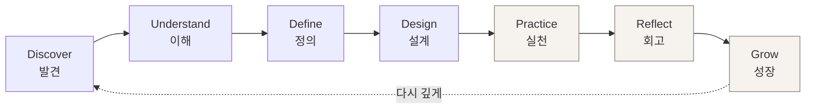
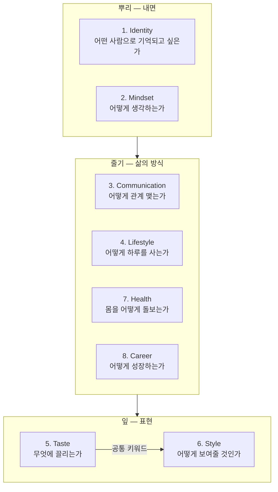
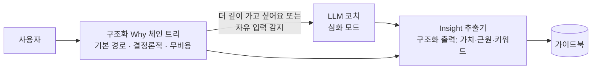
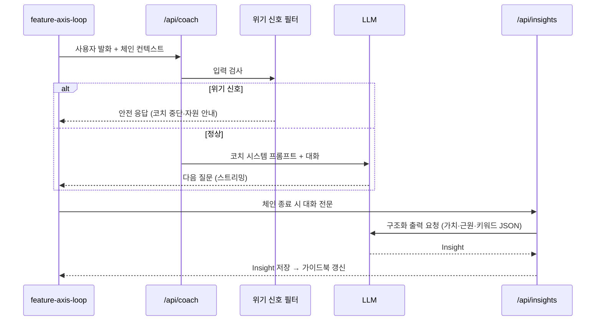

# Identity OS — 제품 설계 문서

> **추구미를 통해 나를 발견하는 자기 이해 플랫폼.**
> 사람들은 '추구미를 찾으러' 들어와서, '나를 발견하고' 돌아간다.

**이 문서의 전제 (설계 결정)**

- 기존 **'추구미' 프로젝트는 Identity OS의 진입 퍼널(Discover 모듈)로 흡수**한다. "정은채 같은 스타일을 갖고 싶다"로 들어온 사용자를 "나는 차분함과 지적인 분위기를 동경하는 사람이구나"로 데려가는 첫 관문이 바로 그 가벼운 추구미 여정이다.
- 데이터는 **단계적으로 도입**한다. Discover~Define(발견·정의)까지는 기존처럼 익명·클라이언트 우선, Practice~Grow(실천·회고·성장)로 넘어가는 순간에만 계정 + DB(Supabase)를 요구한다.
- AI 코치는 **하이브리드**: 구조화된 Why 체인 질문 트리가 기본 경로(결정론적, 무비용), LLM 코치는 심화 모드.

---

## 1. 비전과 포지셔닝

### 1.1 겉과 실체

|        | 겉 (마케팅 표면)   | 실체 (제품의 목표)                |
| ------ | ------------------ | --------------------------------- |
| 무엇   | 추구미 찾기 서비스 | 자기 이해 플랫폼                  |
| 입력   | 끌리는 것 고르기   | 왜 끌리는지 탐색하기              |
| 산출물 | 스타일보드         | **My Life Guide (삶의 가이드북)** |
| 끝     | 결과 화면          | 끝나지 않는 성장 루프             |

이 이중 구조는 기만이 아니라 **온보딩 전략**이다. "자기 이해를 시작하세요"는 아무도 클릭하지 않지만, "내 추구미 찾기"는 클릭한다. 가벼운 문으로 들어와 깊은 방을 발견하게 하는 것 — 제품 전체가 이 낙차 위에 설계된다.

### 1.2 제품 불변식 (Invariants)

어떤 기능을 추가하든 깨서는 안 되는 규칙:

1. **Identity → Style. 절대 역방향 금지.** 스타일 제안은 반드시 그 사용자의 Identity가 먼저 정의된 뒤에만 등장한다. 정보 구조(IA), 축의 순서, 내비게이션, 추천 로직 전부에 적용된다. Style 축이 8축 중 6번째에 있는 것은 우연이 아니라 강제다.
2. **분석하는 것은 롤모델이 아니라 사용자다.** "정은채 스타일 분석" 같은 기능은 만들지 않는다. 롤모델은 언제나 사용자 내면을 비추는 거울로만 쓴다: "그 사람의 어떤 점이 부러운가요?"
3. **AI는 답하지 않는다. 묻는다.** 코치의 발화는 질문·반영·요약으로 제한된다. 판정("당신은 ~형입니다")과 처방("~하세요")은 금지.
4. **결과는 한 줄이 아니라 한 사람이다.** 어떤 화면도 사용자를 하나의 라벨로 축약해 **끝내지** 않는다. 모든 라벨은 가이드북의 한 페이지일 뿐이다.

   > **개정 (네 글자의 도입)** — 여정 전체를 네 글자로 접는 **나의 네 글자**(§4.5)는 이 불변식의 선을 밟는다. 몰래 넘지 않기 위해 조건을 달아 개정한다. 네 글자는 다음 넷을 모두 지킬 때에만 존재한다.
   >
   > 1. **측정되지 않고 얻어진다.** 문항의 채점이 아니라 여덟 축 마흔 번의 선택이 남긴 잔여물이다. 그래서 처음엔 흐릿하고, 축을 지날 때마다 한 자리씩 또렷해진다.
   > 2. **날짜가 붙는다.** 영구 라벨이 아니라 그때의 나다. 연표(§4.7)에 판마다 날짜와 함께 쌓이고, 계절이 지나면 바뀔 수 있다.
   > 3. **가이드북으로 돌아간다.** 요약이지 대체가 아니다. 글자마다 어느 갈래에서 왔는지 펼쳐지고, 아슬아슬했던 갈래는 아슬아슬했다고 적는다.
   > 4. **"성격유형"이라 부르지 않는다.** 이름은 「나의 네 글자」이고, 열여섯 자리의 이름은 전부 **자리(장소)** 다 — 사람을 유형으로 부르면 판정이 되지만, 자리로 부르면 "지금 잘 지내는 곳"이 된다.

### 1.3 차별화 — 우리가 하지 않는 것

퍼스널컬러 진단 없음. 패션 추천 없음(Identity 없이 단독으로는). 기존 서비스는 "당신은 무엇이다"를 팔고, Identity OS는 "당신은 왜 그런가"를 묻는다.

**MBTI와의 관계는 '없음'에서 '뒤집기'로 바뀌었다.** 네 글자라는 형식 자체는 잘못이 없다 — 문제는 그것이 (a) 십 분짜리 문항으로 **거저 주어지고**, (b) **판정**으로 쓰이며, (c) **고정**이라는 데 있었다. 그래서 셋을 모두 뒤집는다: 네 글자는 여덟 축을 걸어야 채워지고(비싸다), 걸어온 자국의 요약일 뿐이며(판정이 아니다), 날짜가 붙어 계절마다 다시 쓰인다(고정이 아니다).

마지막 것이 결정적이다. **MBTI는 유형이 고정이라 한 번 오고 끝나지만, 유형에 날짜가 붙으면 다시 올 이유가 생긴다.** 주기적 재방문의 설계는 전부 여기서 나온다.

---

## 2. 사용자 여정 — 7단계 성장 루프



| 단계           | 사용자가 하는 일                                                    | 시스템이 하는 일                                              | 데이터             |
| -------------- | ------------------------------------------------------------------- | ------------------------------------------------------------- | ------------------ |
| **Discover**   | 추구미 여정(기존 갈림길 플로우)으로 가볍게 시작. 끌리는 것을 고른다 | 취향 벡터·무드 도출, "왜 이게 끌렸을까?"라는 첫 질문을 심는다 | 익명 (시퀀스)      |
| **Understand** | Why 체인을 따라 내려간다: 부러움→이유→기억→가치                     | 발견 조각(Insight) 수집, 공통 키워드 추출                     | 익명 (로컬)        |
| **Define**     | Identity Statement와 핵심 가치를 언어로 확정한다                    | 가이드북의 뼈대 생성                                          | 익명 (로컬)        |
| **Design**     | 이상적인 하루·관계·성장 방식을 설계한다                             | 축별 Blueprint 작성 지원                                      | **계정 전환 지점** |
| **Practice**   | 작은 실천을 고르고 수행한다                                         | 실천 카드 발행, 리마인드                                      | 계정 + DB          |
| **Reflect**    | 주기적 회고: 무엇이 맞았고 무엇이 아니었나                          | 회고 프롬프트, 가이드북과의 대조                              | 계정 + DB          |
| **Grow**       | 가이드북을 수정한다 — 나는 계속 바뀌는 사람이므로                   | 버전 히스토리, 변화의 시각화                                  | 계정 + DB          |

**계정 요구 시점의 원칙**: "가치가 증명되기 전에는 아무것도 요구하지 않는다." Discover~Define까지 사용자는 이미 자기 Identity Statement라는 보상을 받았다. 그것을 _간직하고 이어가고 싶어지는 순간_ — 그때가 로그인의 자연스러운 동기다.

---

## 3. Self Discovery Framework — 8축 도메인 모델

### 3.1 축의 구조

8개 축은 평평한 목록이 아니라 **의존 순서가 있는 레이어**다:



- **Identity와 Mindset이 뿌리**: 다른 모든 축의 답은 이 둘을 참조한다.
- **Style은 잎**: Identity가 정의되기 전에는 잠겨 있다(문자 그대로 UI에서 잠금). Taste에서 추출된 공통 키워드가 Style의 입력이 된다 — "차분함·우드·베이지·미니멀·필름·여백 → Quiet Minimal".
- 예외적으로 **Discover 단계의 추구미 여정은 Taste의 가벼운 버전**이다. 순서 위반처럼 보이지만, 그 여정의 출구가 "왜 이게 끌렸을까?"(Identity로의 초대)이므로 불변식을 지킨다. 잎을 보여주며 뿌리로 초대하는 구조.

### 3.2 축 공통 루프: 선택 → 질문 → 이유 → 실천 → 회고

모든 축은 같은 5단계 마이크로 루프를 가진다. 이것이 프레임워크의 핵심 재사용 단위다.

| 단계     | 형식                                  | 예 (Identity 축)                               |
| -------- | ------------------------------------- | ---------------------------------------------- |
| **선택** | 가벼운 카드 고르기 (부담 없는 입구)   | "어떤 사람을 보면 가장 부럽나요?" — 유형 카드  |
| **질문** | 선택을 파고드는 구체 질문             | "그 사람의 어떤 점이 부러운가요?"              |
| **이유** | **Why 체인** — 3~5회 깊이의 연쇄 질문 | "왜 그게 중요한가요?" → "그건 언제부터였나요?" |
| **실천** | 발견을 행동 하나로 번역               | "이번 주, 그 사람이 할 법한 일 하나를 해보기"  |
| **회고** | 실천 후 되돌아보기                    | "해보니 어땠나요? 여전히 동경하나요?"          |

> **ver1의 범위** — 지금 구현된 것은 앞의 셋(선택·질문·이유)과 **명명**까지다. 실천·회고는 계정이 필요한 구간(Phase 4)에 속하므로 축에서 뺐다. 한동안 축마다 실천 카드 한 장을 고르게 했는데, 여덟 축을 걸으면 실천이 여덟 개 쌓여 거울이 할 일 목록이 됐다 — 처방 금지(§5.1)의 가장 미끄러운 자리이기도 했다. **축은 분석까지만 하고**, 건네는 것은 여정 끝의 맺음(§4.6) 하나뿐이다.

각 루프의 산출물은 **Insight(발견 조각)** 이다: `"안정감을 중요하게 여김 — 어릴 때의 불안 경험에서"` 같은, 출처가 있는 자기 이해의 최소 단위. 가이드북은 이 조각들의 조립이다.

### 3.3 Why 체인 설계

```
표면 진술          "돈이 많고 싶다"
  ↓ 왜?
동기              "안정감 때문"
  ↓ 왜 중요한가?
근원              "어릴 때 불안했던 경험"
  ↓ (여기서 멈춤)
가치 명명          → Insight: "안정 (근원: 유년의 경험)"
```

설계 규칙:

- **깊이 제한 3~5.** "왜?"의 무한 반복은 심문이 된다. 근원(기억·경험)에 닿거나 깊이 한도에 도달하면 코치는 캐묻기를 멈추고 **명명(naming)** 으로 전환한다: "그렇다면 당신에게 중요한 건 '안정'이네요. 맞나요?"
- **모든 단계에서 "이건 넘어갈래요" 제공.** 자기 탐색은 자발적일 때만 유효하다. 건너뛴 질문도 데이터다(민감 영역 표시).
- **근원이 아픈 기억일 수 있다.** §6의 안전장치가 이 지점에 걸린다.

### 3.4 크로스축 키워드 그래프

Taste 축의 "공통 키워드 추출"은 사실 전 축에 적용되는 메커니즘이다. 모든 Insight와 선택에는 키워드가 태깅되고, 축을 가로질러 같은 키워드가 반복 등장하면 그것이 **Life Keyword**로 승격된다.

```
Identity에서 "차분함" + Taste에서 "미니멀·여백" + Communication에서 "경청"
→ Life Keyword: 「고요함」 — 가이드북 표지에 오르는 단어
```

이 그래프가 Identity OS의 실질적 데이터 자산이다. 무드 매칭(기존 추구미의 코사인 유사도)의 확장판: 축 하나의 벡터가 아니라, 삶 전체를 관통하는 키워드 그래프.

### 3.5 당김과 긴장 — 상쇄되지 않는 자리 (`axis/pull.ts`, `axis/tension.ts`)

키워드 그래프가 축을 가로질러 **같은 것**을 찾는다면, 이쪽은 **어긋난 것**을 찾는다.

문제는 셈법에 있었다. 축의 결과는 `Canon` 네 갈래로 각인되어 **더해지는데**(§`sumCanon`), 더하기는 반대를 지운다. 자유를 동경하며 안정된 하루를 지은 사람이 '가운데쯤'으로 접혔다 — 가장 할 말이 많은 사람이 가장 할 말이 없는 사람으로 나왔다. 자기이해의 깊이는 대개 상쇄되지 않는 곳에서 오는데, 엔진에 그것이 남을 자리가 없었다.

그래서 **당김(pull)** 을 따로 둔다. Canon과 층위가 다르다.

| | Canon (`canon.ts`) | 당김 (`pull.ts`) |
|---|---|---|
| 묻는 것 | 어떤 인상인가 | 무엇을 얻으려 무엇을 내주는가 |
| 갈래 | 고요/생동 · 부드/또렷 · 오래된/지금 · 안/밖 | 안정/자유 · 곁/나 · 나중/오늘 · 깊이/넓이 |
| 셈법 | 더해서 하나로 접는다 → 네 글자 | **더하지 않는다.** 축마다 따로 서 있는다 |
| 산출 | 여정의 요약 | 여정의 **접히지 않은 것** |

네 갈래는 모두 **진짜 트레이드오프**다 — 둘 다 가질 수 있는 것은 적지 않는다. 둘 다 가질 수 있으면 긴장이 생기지 않고, 긴장이 없으면 할 말도 없다. 구조는 Schwartz 가치 원형에서 빌렸다(값진 것들은 원 위에서 마주 본다). 문항과 채점은 빌리지 않았다 — 이 앱은 사람을 재는 곳이 아니라 사람이 스스로 이름 붙이는 곳이므로.

**어디에 적히나.** 결과마다 또렷한 하나둘만 적고 대개는 비운다. 넷을 다 채우면 모든 축이 모든 갈래에서 조금씩 당겨 긴장이 아무 데서나 나오고, 그러면 아무 뜻도 없어진다. **표현의 두 축(Taste·Style)은 통째로 비어 있다** — 취향은 트레이드오프가 아니라서, 억지로 매기면 없는 모순이 만들어진다.

**언제 긴장이 되나.** 같은 갈래에서 한쪽 끝(≤ −0.4)과 다른 쪽 끝(≥ +0.4)을 각각 잡고 있고, 벌어짐이 1.2 이상일 때. 갈래 하나에서는 가장 멀리 벌어진 한 쌍만 꺼낸다 — 셋을 늘어놓으면 목록이 되고, 목록은 아무도 읽지 않는다.

**긴장은 두 곳으로 나간다.**

1. **걷는 중 — 물음이 갈린다** (`tensionProbe`). 앞선 축이 서로 당기고 있으면 그 축의 **마지막 깊은 물음이 통째로 갈려**, 두 결과의 이름을 그대로 부르며 "여기서는 어느 쪽이 이기나요"를 묻는다. 여기가 앞 축과 뒤 축이 실제로 만나는 유일한 자리다 — 그전까지 앞 축의 영향은 좌표를 미는 것뿐이었고, 그 상한(0.9/`SPREAD` 4)은 **일곱 축을 다 걸어와도 클릭 한 번(0.8)만큼**이었다.

   다만 **새로 벌어진 긴장만** 묻는다(`freshTension`). 가장 큰 긴장을 계속 물었더니 한 번 열린 긴장이 남은 여섯 축을 전부 점령해 같은 두 이름이 반복됐다 — 앞 축이 뒤 축을 바꾸는 게 아니라 앞 축 하나가 여정을 차지하는 꼴이었다. 지금은 판당 대개 한 번(0회 22% · 1회 55% · 2회 23%), 갈래가 넷이라 많아야 네 번이다.

2. **맺음 — 접히지 않은 자리** (§4.6). 한 문장이 여정을 하나로 접는다면 이쪽은 접히지 않은 것을 남긴다. 둘까지만 놓는다. 요약만 있는 맺음은 사람을 실제보다 매끈하게 만들고, 매끈한 요약은 자기 얘기로 읽히지 않는다.

**판정하지 않는다**(불변식 #3). "당신은 모순적이다"가 아니라 "이 둘이 함께 있다"이고, 어느 쪽으로 가라고 말하지 않는다. 대신 양쪽 모두의 값을 적는다 — 트레이드오프를 트레이드오프라고 말해주는 데까지가 거울의 일이다. 모순은 고칠 것이 아니라 그 사람이 지고 있는 것이고, 대개 그게 그 사람이다.

> 리플레이 주의: 갈린 물음은 선택지가 넷이라 원래 물음(다섯~여섯)보다 적다. 이 변경 전에 그 자리에서 다섯째·여섯째를 고른 발자국은 거기서 잘리고 그 걸음만 다시 걷게 된다(`replayAxis`가 어긋난 발자국을 잘라내는 기존 동작).

---

## 4. My Life Guide — 최종 산출물 스키마

가이드북은 정적 리포트가 아니라 **버전이 있는 살아있는 문서**다.

```ts
interface LifeGuide {
  version: number; // Grow 단계마다 증가 — "나는 계속 수정된다"
  updatedAt: string;

  identity: {
    statement: string; // "나는 __을 동경하고, __을 향해 가는 사람이다"
    rememberedAs: string[]; // 어떤 사람으로 기억되고 싶은가
    roleModelMirror: string[]; // 롤모델에게서 발견한 '나의' 동경 포인트
  };
  coreValues: Value[]; // 이름 + 근원(Why 체인의 출처) + 우선순위
  lifeKeywords: string[]; // 크로스축 승격 키워드
  tasteKeywords: string[]; // Taste 축 공통 키워드 (예: Quiet Minimal)

  communicationStyle: { listening: string; conflict: string; humor: string };
  lifestyleBlueprint: {
    morning: string[];
    evening: string[];
    rest: string[];
    space: string[];
  };
  styleGuide: {
    // ⚠ identity.statement가 없으면 생성 불가 (불변식 #1의 코드화)
    directions: string[]; // 기존 추구미의 무드·스타일보드가 여기 편입된다
    styleboardUrl?: string;
  };
  careerCompass: { growthMode: string; learning: string[]; goals: string[] };
  healthRoutine: { sleep: string; movement: string; stress: string };

  actionPlan: ActionItem[]; // 실천 카드 — Practice 루프의 입력
}

interface Value {
  name: string;
  origin: string;
  whyChainId: string;
} // 모든 가치는 출처를 가진다
interface ActionItem {
  axis: AxisId;
  action: string;
  cadence: string;
  status: "active" | "done" | "retired";
}
```

핵심 설계: **`styleGuide`는 `identity.statement`에 대한 타입 수준 의존성을 가진다.** 불변식 "Identity → Style"을 문서 스키마와 생성 로직 양쪽에서 강제한다.

렌더링: 웹 뷰(노션 페이지 톤) + PDF 내보내기(간직하는 물성) + 버전 diff 뷰("3개월 전의 나 vs 지금의 나").

---

### 4.5 나의 네 글자 — 여정 전체의 요약

축 하나의 이름이 **8분면(세 극)** 에서 온다면, 네 글자는 **여정 전체(네 갈래)** 에서 온다. 층위가 겹치지 않고 포개진다.

새로 만든 좌표가 아니다. `Canon`이 이미 네 갈래의 양극이므로, 하는 일은 꺼내 보이는 것뿐이다.

| 갈래      | −         | +         | 글자    | 이 갈래를 자기 막대로 읽는 축 |
| --------- | --------- | --------- | ------- | --------------------------- |
| `reach`   | 머무름    | 뻗어감    | **Q/V** | 여덟 축 전부 |
| `form`    | 흐름      | 윤곽      | **S/K** | 여덟 축 전부 |
| `modern`  | 오래된 것 | 지금의 것 | **R/N** | **Taste·Style 둘뿐** |
| `outward` | 안으로    | 밖으로    | **I/O** | 나머지 여섯 축 |

→ `QSRI`, `VKNO` … **열여섯 자리.** 이름은 전부 장소다: 「오래된 서재」 「한밤의 실험실」 「광장의 신호등」.

> **이름을 한 번 고쳤다** — 앞의 두 갈래는 `vivid`(고요함↔생동감)·`sharp`(부드러움↔또렷함)였다. 이 좌표가 추구미의 미학 어휘에서 왔기 때문인데, 여덟 축으로 넓히면서 이름만 그대로 남았다. Taste·Style에는 정확했지만 Career의 「쌓는 쪽↔뻗는 쪽」이나 Mindset의 「느낌으로↔따져서」를 '생동감'·'또렷함'이라 부르는 것은 사실과 달랐다. 숫자는 하나도 건드리지 않았고 이름만 실제 내용에 맞췄다.
>
> **글자(Q/V·S/K…)는 고정이다.** 열쇠 문자열이 결 연표에 저장되고 공유 링크(`/codes?me=`)에도 실려 다니므로, 글자를 바꾸면 지난 판과 남이 보낸 링크가 함께 깨진다. 사람이 읽는 것은 한국어 이름이고, 글자는 이제 자리표에 가깝다.

**흐릿함에서 또렷함으로.** 코드는 끝에 주지 않고 **처음부터 흐릿하게** 준다.

```
축 1 완료   · · · ·        축 4 완료   Q S · ·
축 6 완료   Q S · I        축 8 완료   Q S R I  「오래된 서재」  ← 봉인
```

`Canon` 성분이 한가운데에서 얼마나 벗어났는지가 곧 확신도다(`SETTLE` 문턱). 한 축으로 자리를 잡는 글자는 평균 반 자리이고, 네 자리가 다 차려면 대개 여섯 축이 넘게 걸린다. 이것이 **자기 이해 서비스의 최대 난점 — "두 시간짜리 여정의 보상이 끝에만 있다" — 에 대한 답**이다: 축을 끝낼 때마다 눈에 보이는 증표가 늘어난다. 그리고 정직하다. 실제로 덜 확실하므로 덜 확실하게 보인다.

**한가운데(`CENTER`)가 이 계산의 전부다.** 각인(imprint)은 0을 가운데 두고 흩어져 있지 않다. 네 갈래 모두 양(+)으로 치우쳐 있고, 앞 축이 뒤 축을 같은 방향으로 기울이므로(`project`) 걸을수록 쏠림이 커진다. 각인을 그대로 더해 부호만 읽으면 열여섯 중 하나가 절반을 먹는다. 그래서 기준을 0이 아니라 **실제로 걸어서 닿는 값들의 한가운데**로 옮긴다 — 네 글자가 재는 것은 절대량이 아니라 "여기까지 걸어온 사람들 사이에서 어느 쪽인가"이므로, 이쪽이 원래 맞는 셈법이기도 하다.

`CENTER`는 표를 평균한 값이 아니라 무작위 4000판에서 잰 **측정값**이고, 축 데이터를 크게 손보면 조용히 어긋난다. 그 관문이 `code.test.ts`의 분포 테스트다 — 글자마다 38~62%, 열여섯 자리 전부 도달, 한 자리가 30% 미만.

#### 상관을 푼 자리와 남은 자리

한때 네 갈래가 서로 심하게 **상관**돼 있어서 대각선 두 모서리(`VKNO`·`QSRI`)가 판의 40%를 먹었다. 원인을 둘로 갈라 재보니 이랬다.

| 원인 | 정체 | 손봤나 |
| --- | --- | --- |
| **각인의 넷째 열** | 아무도 막대로 보지 않는 열이라 손으로 적을 때 `reach`를 그대로 베꼈다 — 축마다 상관 0.5~0.85 | **풀었다** |
| **선택지 자체의 얽힘** | 「밖으로 나가는 선택」이 대개 「활기찬 선택」이기도 하다 — 내용에 박혀 있다 | 남았다 |

손본 것은 셋이다. (a) Communication·Career의 첫 극을 `reach`에서 `modern`으로 옮겼다 — 「좁고 깊게↔넓고 가볍게」와 「쌓는 쪽↔뻗는 쪽」은 원래 시간의 갈래에 가깝고, 덕분에 `modern`을 읽는 축이 둘에서 넷이 됐다. (b) 축마다 **안 읽는 극 한 열**(8×8=64개)을 그 결과가 실제로 무엇에 기대는지로 다시 적었다. (c) `CENTER`를 여덟 축 지점에서 다시 쟀다.

| | 전 | 후 |
| --- | --- | --- |
| 최다 자리 | `VKNO` 19.8% | `VKNO` 16.5% |
| 상위 두 자리 합 | 39.1% | 31.1% |
| 글자별 + 비율 | 48.9~52.2% | 49.8~52.2% |
| `form × modern` | 0.32 | **−0.12** |
| `modern × outward` | 0.75 | **0.60** |
| `reach × modern` | 0.63 | **0.53** |
| `reach × outward` | 0.85 | 0.84 |

> **남은 하나** — `reach × outward` 0.84는 거의 그대로다. 기울기(`project`)의 되먹임을 의심해 **가중치를 0으로 놓고 재봤더니 0.71**이었다 — 되먹임이 아니라 선택지 내용 자체가 얽혀 있다는 뜻이다. 푸는 유일한 길은 **두 극을 가로지르는 선택지를 새로 쓰는 것**이다(「밖에 나가지만 조용한」, 「집에 있지만 분주한」). 숫자를 깎아 흉내 내볼 수도 있었지만 — 실제로 234개 선택지의 셋째 기울기를 줄여봤다 — 상관은 0.85에서 0.83으로만 내려갔고 손으로 적은 값만 뭉개져서 되돌렸다. 이건 계산이 아니라 글의 문제다.
>
> 완전한 독립은 목표가 아니다. 활기와 바깥은 삶에서 실제로 함께 오고, 억지로 풀면 거울이 아니라 격자가 된다. 다만 '옅은 사본'은 다시 생기지 않도록 `code.test.ts`에 관문을 뒀다 — 0.65를 넘는 쌍은 `reach × outward` 하나뿐이어야 한다.

### 4.6 맺음 — 문장 하나, 책 하나, 노래 하나

여정이 끝나는 자리에는 **한 번만** 놓인다. 넷뿐이다:

1. **여정 전체를 접은 한 문장** — 시작한 자리(동경했던 것)와 여덟 축이 남긴 결을 접은 네 글자가 한 문장에 함께 있다. 축의 이름 여덟 개를 이어 붙이지 않는다(그러면 문장이 아니라 암호가 된다). 여덟 축을 다 걸으면 여러 줄이던 '나의 문장'이 이 한 문장으로 **바뀐다**.
2. **접히지 않은 자리** — 여덟 축이 서로 반대쪽으로 당기고 있는 곳, 많아야 둘(§3.5). 1번이 여정을 하나로 접는다면 이쪽은 접히지 않은 것을 남긴다. 없을 수도 있다.
3. **구절 하나 + 그것이 온 책**
4. **노래 하나 + 왜 이 결에 놓였는지 우리가 적은 한 줄**

> 1번과 2번은 **함께 있어야** 맺음이 거울이 된다. 요약만 놓인 맺음은 사람을 실제보다 매끈하게 만들고, 매끈한 요약은 자기 얘기로 읽히지 않는다.

> **한때 서재였다** — 하루에 한 꾸러미씩 꽂혀 반년이면 스무 칸이 되는 자리였다. 재방문의 이유로는 훌륭했지만, 축마다의 쪽지와 네 글자와 연표 위에 그것까지 얹히자 가이드북이 서랍이 됐다 — 무엇을 보러 왔는지 잊게 하는 종류의 풍요. 재방문의 축은 연표(§4.7)가 이미 갖고 있으므로, 서재는 맺음 하나로 접었다.

#### 가이드북의 정리 — 쌓이는 것과 놓이는 것

같은 이유로 화면도 한 번 걷어냈다. 축의 결과가 쪽지 서랍에 쌓이면서 목차와 서랍이 같은 것을 두 번 말하고 있었다.

- **축의 결과는 목차의 제자리에서 연다.** '작성됨' 뱃지를 「결과 보러가기」 버튼으로 키웠다. 결과를 찾으러 다른 곳으로 가지 않는다.
- **네 글자는 상자 하나로 놓인다.** 축 하나를 끝내고 돌아왔을 때의 첫 소식이므로 접어두지 않되, 근거(축 막대·네 갈래·어디서 왔나요)까지 펼치면 그것만으로 화면이 찬다 — 그래서 「더보기」 뒤에 둔다. 그리고 **봉인 전에는 이름을 부르지 않는다**: 쪽지 안에서는 펼쳐본 사람의 몫이었지만, 화면에 놓이는 순간 아직 얻지 않은 이름을 선언하는 꼴이 되기 때문이다(불변식 #4).
- **쪽지는 다 걸었을 때만 붙는다.** 여정 전체에서 나온 둘 — '나의 문장'과 '결 연표'. 걷는 동안엔 판이 비어 있고, 새 판을 시작하면 다시 빈다. 반쯤 적힌 문장은 읽히기보다 진행률로 읽히고, 새 판을 걷는 중에 지난 판의 연표를 펼쳐두면 아직 걷는 사람에게 끝난 이야기를 읽히는 셈이 된다.
- **쪽지는 작다.** 판 하나에 압정으로 붙인 것처럼 살짝 기울어진 80px 타일이고, 손이 닿으면 반듯해진다. 한때 150px짜리 카드였는데 — 작은 것을 크게 만들면 중요해 보이는 게 아니라 비어 보인다.
- **금빛은 한 자리뿐이다.** '나의 문장'만 금빛으로 켜지고 천천히 숨 쉰다(`animate-shine`). 여덟 축을 다 걸어야 생기는 것이므로 흔해질 수 없고, 흔해지지 않아야 금빛이 뜻을 갖는다.

### 4.6.1 축하 화면 — 삼 초

여덟 축을 다 걸어 판이 **봉인되는 그 순간에만** 전면 팝업이 뜬다. 오브가 눈을 반짝이고 빛이 세 겹으로 퍼지고, 삼 초 뒤 스스로 물러난다.

- **닫는 버튼이 없다.** 축하에 확인 버튼을 붙이면 축하가 아니라 안내가 된다. 링크도 CTA도 두지 않는다 — 다 보고 나면 원래 있던 가이드북이 그대로 아래에 있다.
- **판마다 정확히 한 번.** 조건은 "다 걸었는가"가 아니라 **"방금 봉인됐는가"** 다(`appendEntry`가 같은 발자국을 한 번만 받는다). 완주한 가이드북을 열 때마다 폭죽이 터지면 그건 축하가 아니다.
- 오브의 세 번째 표정 `spark`(반짝이는 눈)가 여기서 생겼다. 완주한 사람 앞에서 오브가 잠들어(`rest`) 있을 이유도 없으므로, 가이드북 하단의 오브도 다 걸으면 이 표정을 쓴다.

- **추천이 아니라 선물이다.** "당신에게 이 책을 권합니다"가 아니라 "이 구절이 당신의 결과 같은 곳을 짚어요, 그리고 이건 그 구절이 온 책이에요". 처방 금지(불변식 #3)가 이 형태 하나로 지켜진다.
- **가사는 싣지 않는다.** 권리 문제이기도 하고, 구절의 자리는 이미 책이 갖고 있다. 노래가 갖는 것은 제목·부른 이·우리의 한 줄뿐.
- **링크는 없다. 제목만 복사한다.** 바깥으로 나가는 문을 만들면 선물이 광고처럼 보이기 시작한다.
- **여덟 축을 다 걸어야 열린다.** 중간에 조금씩 나눠 주면 맺음이 아니라 적립이 된다. 대신 하루 한 번씩 조르지도 않는다 — 걸어서 끝냈으면 한 번에 다 받는다.
- **저장하지 않는다.** 발자국에서 매번 다시 계산되므로 같은 판이면 언제 열어도 같은 구절이 놓인다.
- 고르는 방식은 축과 같다(가까운 결). **넓히는 일은 화면 작업이 아니라 `closing/passages.ts`·`tracks.ts`에 줄을 더하는 데이터 작업이다.** 줄을 더할 때는 출처를 반드시 확인할 것.

### 4.7 결 연표와 계절 — 주기적 재방문의 축

```
2026.03   QSRI  「오래된 서재」
2026.06   QSRI   그대로
2026.09   QSNI  「밤의 작업실」   ← 오래된 것 → 지금의 것, 한 갈래가 움직였다
```

- 여덟 축을 모두 걸면 그 판이 **봉인**되어 연표에 날짜와 함께 남는다. 같은 발자국은 한 번만.
- **순서 불변식은 건드리지 않는다.** 계절(90일)이 열어주는 것은 '중간 축 다시 걷기'가 아니라 **한 판을 새로 걷기**다 — 1에서 8로, 처음부터. 지난 판은 지워지지 않는다.
- 코드가 바뀌면 그 자체가 사건이 된다: _"한 갈래가 움직였어요."_ 이것이 `LifeGuide.version`과 "나는 계속 수정된다"가 문서의 문장이 아니라 화면의 물건이 되는 지점이다.
- 연표는 **판이 바뀌어도 지워지지 않는다.** 발자국(진행 중인 판)과 간직되는 것(누적)의 수명이 다르다. 맺음은 저장되지 않고 발자국에서 매번 계산되므로 발자국과 수명을 같이한다.

### 4.8 겹쳐보기 — 점수 없이, 질문 하나

두 사람의 네 글자를 나란히 놓는다(`/together?with=QSRI`).

**점수도 궁합도 없다.** 사람을 견주기 시작하면 그 순간 이 제품은 판정기가 된다. 그래서 산출물은 등급이 아니라 **질문**이다: 겹친 갈래는 겹쳤다고 적고, 갈린 갈래에는 서로에게 물어볼 말 하나를 놓는다("쉬는 날, 각자 어떻게 힘을 되찾는지 서로 물어보세요"). 네 갈래가 모두 같으면 겹친 자리의 **사각**을 묻는다.

오가는 것은 네 글자뿐이다 — 발자국도 축의 이름도 링크에 싣지 않는다. 내면의 기록은 각자의 브라우저에 남고, 링크에는 결의 방향만 실린다.

**열여섯의 지도**(`/codes`)는 내 칸이 어디쯤인지 알려주는 자리다. 한 갈래만 달랐다면 어디였는지 — 축의 '경계의 이웃'과 같은 뜻을 여정 전체 수준에서 되풀이한다.

---

## 5. AI 코치 설계

### 5.1 하이브리드 구조



- **기본 경로 = 구조화 트리.** 각 축의 선택→질문→이유는 미리 설계된 분기 트리로 동작한다. 기존 추구미의 리플레이 엔진(응답 시퀀스 = 원본 상태)을 그대로 재사용한다. 빠르고, 무비용이고, 익명 단계에서 서버가 필요 없다.
- **심화 모드 = LLM 코치.** 트리의 잎에 도달했거나, 사용자가 선택지 대신 자기 언어로 쓰고 싶어질 때 전환. 대화는 서버 프록시(API 키 보호)를 거친다.
- **모든 경로의 출구는 Insight 추출.** 자유 대화도 결국 구조화된 조각(가치·근원·키워드)으로 변환되어야 가이드북에 쌓인다. LLM 심화 모드는 구조화 출력(JSON 스키마)으로 Insight를 반환한다.

### 5.2 코치 프롬프트 원칙 (시스템 프롬프트 골격)

```
당신은 자기 이해를 돕는 코치다. 역할은 질문·반영·명명이며, 그 외의 발화는 하지 않는다.

하는 것:
- 열린 질문: "왜 그렇게 생각하나요?" "그 감정은 언제 처음 느꼈나요?"
  "그 사람의 어떤 점이 좋았나요?" "그것이 당신에게 중요한 이유는 무엇인가요?"
- 반영: 사용자의 말을 짧게 되돌려준다. 해석을 덧붙이지 않는다.
- 명명 제안: 근원에 닿으면 가치의 이름을 '제안'하고 사용자가 승인하게 한다.

하지 않는 것:
- 판정 금지: "당신은 ~한 사람입니다" 단정 금지. 항상 "~인 것 같나요?"로 확인.
- 처방 금지: 조언·해결책·추천 금지. 축은 분석까지만 하고 할 일을 제안하지 않는다.
- 심문 금지: '왜'는 한 주제당 최대 5회. 같은 질문 반복 금지.
  사용자가 머뭇거리면 "넘어가도 괜찮다"를 먼저 말한다.

안전:
- 자해·자살·학대·심각한 고통의 신호가 보이면 탐색을 멈추고,
  공감 → 전문 도움 안내 → 대화 종료 순서를 따른다. 절대 그 주제를 파고들지 않는다.
- 이 서비스는 심리 치료가 아님을 안다. 진단적 언어(우울증, 트라우마 등)를 먼저 꺼내지 않는다.
```

### 5.3 안전장치 (제품 수준)

Why 체인은 설계상 유년의 기억, 불안, 결핍에 닿는다. 이는 기능이면서 동시에 리스크다.

- **온보딩 고지**: "이 여정은 스스로를 이해하기 위한 도구이며, 심리 상담이나 치료를 대신하지 않아요."
- **위기 신호 분류기**: LLM 심화 모드의 입력에 자해·위기 신호 감지를 상시 적용. 감지 시 코치 페르소나를 중단하고 전문 자원 안내로 전환.
- **감정 강도 체크포인트**: 깊은 체인 이후 "지금 마음이 어때요?" 한 번 — 무겁다는 답이면 가벼운 축(Taste 등)으로 전환 제안.
- **넘어가기의 정상화**: 모든 질문에 스킵 제공, 스킵을 실패로 표현하지 않음.

---

## 6. 시스템 아키텍처 — 추구미 모노레포의 확장

### 6.1 확장 경로

기존 구조를 버리지 않는다. `@chugumi/core`의 검증된 패턴(정적 데이터 + 결정론적 리플레이 + 저장 어댑터)이 그대로 Identity OS의 익명 단계를 지탱한다.

```
identity-os/  (기존 chugumi 모노레포에서 확장)
├─ apps/
│  └─ web/                          # 앱 셸 (기존)
│     ├─ app/discover/             # ← 기존 추구미 여정 (journey·discovery·board) 이관
│     ├─ app/axes/[axis]/          # 8축 각각의 루프 화면
│     ├─ app/guide/                # My Life Guide (웹 뷰 + PDF 내보내기)
│     ├─ app/practice/             # 실천·회고 (계정 필요 구간)
│     ├─ app/api/board/            # (기존) 이미지 생성 프록시
│     ├─ app/api/coach/            # LLM 코치 프록시 + 위기 신호 필터
│     └─ app/api/insights/         # Insight 추출 (LLM 구조화 출력)
├─ packages/
│  ├─ core/                        # (기존) 리플레이 엔진·저장 어댑터 — 그대로 재사용
│  ├─ identity-core/               # ★ 신규: 8축 정의·Why체인 트리·Insight·키워드 그래프·가이드북 스키마
│  ├─ coach/                       # 코치 프롬프트·안전 규칙·Insight 추출 스키마 (서버·클라 공용 순수 TS)
│  ├─ design-system/               # (기존) — Identity OS 톤으로 토큰 확장 (여백·타이포 중심)
│  ├─ feature-journey/…board/      # (기존) Discover 모듈로 역할 재정의
│  ├─ feature-axis-loop/           # 신규: 선택→질문→이유→실천→회고 공통 루프 UI (8축 재사용)
│  ├─ feature-guide/               # 신규: 가이드북 뷰·버전 diff
│  └─ feature-practice/            # 신규: 실천 카드·회고
└─ docs/
```

### 6.2 데이터 단계적 도입

| 구간                   | 저장소                                                                                             | 근거                                         |
| ---------------------- | -------------------------------------------------------------------------------------------------- | -------------------------------------------- |
| Discover~Define (익명) | 응답 시퀀스: URL / localStorage (기존 `ProgressStore` 그대로). Insight·초안 가이드북: localStorage | 가치 증명 전에 아무것도 요구하지 않기        |
| Design 진입 시         | **계정 생성 (Supabase Auth)** + 로컬 데이터를 서버로 승격(migration)                               | "간직하고 싶어지는 순간"이 로그인 동기       |
| Practice~Grow          | Supabase: insights, guides(버전), actions, reflections 테이블 (RLS)                                | 시계열·리마인드·버전 diff는 서버 없이는 불가 |

내면 데이터의 민감성 대응: 축별 데이터 열람·삭제권 UI, 가이드북 전체 내보내기(내 데이터는 내 것), Why 체인 원문은 기본 비저장 옵션(Insight 요약만 저장).

### 6.3 LLM 코치 파이프라인



## 7. 디자인 컨셉

톤앤매너: **빛으로 숨 쉬는 미니멀** — 차분함·깊은 여백(Apple/Notion/Linear의 절제) 위에, 부드럽게 빛나는 그라데이션 글로우의 몽환적 무드를 얹는다.

- **팔레트**: 아주 밝은 화이트~아이스 블루 배경(#f5f7ff), 잉크 네이비 텍스트, 포인트는 블루→퍼플 그라데이션(#5b7cfa→#7c5bfa). 배경에는 크게 블러된 오로라 빛(블루·라벤더·시안)이 아주 은은하게 번진다.
- **코치 = 오브(Orb) 캐릭터.** AI 코치는 텍스트 라벨이 아니라 **숨 쉬듯 천천히 맥동하는 빛 덩어리 캐릭터**다. 발광하는 눈, 4초 주기의 호흡 애니메이션, 대화 시 말풍선 옆의 미니 오브, 회고 대기 화면에서는 눈을 감고 잠든 모습. "판정하는 기계"가 아니라 "곁에서 기다리는 존재"라는 AI 역할(§5)의 시각적 번역.
- **화면당 질문 하나.** 넉넉한 여백, 큰 타이포. 생각할 공간이 UI다.
- **하단 CTA는 항상 플로팅.** 주 행동 버튼은 뷰포트 하단에 고정하고 콘텐츠만 그 뒤로 스크롤된다(상단은 배경색으로 부드럽게 페이드). 다음 걸음이 언제나 손끝에 있되, 읽기를 방해하지 않는 구조.
- **감정 자극 금지, 사고 유도.** 애니메이션은 느리고(호흡·표류) 절제되게. 글로우는 장식이 아니라 온도 — 차갑지 않은 기술의 표현.
- **침묵의 허용.** 답을 재촉하는 타이머·진행률 강조 없음(점 5개가 전부). "천천히 생각해도 돼요"가 기본 자세. 회고를 기다리는 오브는 잠들어 있다.
- 기존 추구미(탐험의 언어)와의 관계: Discover 모듈부터 같은 팔레트를 공유하되, 축 루프로 들어갈수록 화면이 비워지고 오브와 질문만 남는다 — **입구는 놀이, 안쪽은 빛이 있는 서재.**

## 8. 로드맵

1. **Phase 1 — Discover 퍼널 (완료)**: 기존 추구미 여정. 이미 구현되어 있다.
2. **Phase 2 — Identity 축 루프**: `feature-axis-loop` + `identity-core`의 Identity 축 Why 체인 트리(구조화, LLM 없이). 출구에서 Identity Statement 발급. 여기까지 익명.
3. **Phase 3 — 가이드북 v1 (완료)**: Identity 섹션이 채워진 My Life Guide 웹 뷰. Style 섹션은 잠금 상태로 노출(불변식의 시각화). PDF·Taste 편입은 미착수.
   3.5. **Phase 3.5 — 여덟 축 개통 (완료)**: 축마다 전용 엔진을 두는 대신 **공통 축 엔진**(`axis/engine.ts`)을 세우고 여덟 축을 그 위에 올렸다. 축 하나는 언제나 여섯 걸음(입구 → 그 안의 구체 → 깊은 물음 셋 → 명명)이고, 축마다 정하는 것은 트리 데이터와 결과 해석(`AxisDef`)뿐이다.

   여정의 순서(1 Identity → 2 Mindset → 3 Communication → 4 Lifestyle → 5 Taste → 6 Style → 7 Health → 8 Career)는 **의존 순서**다. 축을 지날 때마다 결과가 네 갈래의 결 벡터(`Canon`)에 각인되고, 다음 축은 그것을 자기 세 극으로 투영해 좌표의 출발점을 기울인 채 시작한다. 크기는 걸어온 축이 많을수록 커지지만 한 걸음을 넘지 않는다 — 그 축의 다섯 선택이 언제든 뒤집을 수 있어야 판정이 아니라 출발점이므로. 앞 축의 이름은 물음의 말끝·코치의 발화·발견 조각에 직접 인용되고, 결과의 변주는 걸어온 축의 수만큼 넓어진다.

   순서는 문서가 아니라 `walkJourney`의 계산과 그것을 그대로 쓰는 라우트 가드가 지킨다: 앞 축이 완주되지 않으면 뒤 축은 열리지 않고(순서를 어긴 발자국은 아예 읽지 않는다), **다시 걸을 수 있는 것은 가장 마지막에 확정한 축 하나**뿐이며, 다시 걸으면 그 축부터 뒤가 함께 지워진다.

   Style의 뿌리는 이제 Taste다 — §3.1의 "Taste 공통 키워드 → Style 입력"이 실제로 이어졌다.
   3.6. **Phase 3.6 — 네 글자·서재·연표 (완료)**: 여정의 보상과 재방문의 축을 세웠다(§4.5~4.8). `Canon`을 네 글자로 접어 축마다 한 자리씩 채우고(`axis/code.ts`), 하루 한 꾸러미씩 쌓이는 결 서재(`shelf/`, 지금은 맺음으로 접혔다)와 판마다 날짜가 붙는 결 연표(`chronicle.ts`), 점수 없이 질문 하나를 내미는 겹쳐보기(`together.ts`)를 붙였다. 불변식 #4는 네 조건을 달아 개정했다(§1.2).

   **여전히 완전 정적이다.** 코드 산출·맺음·지도·겹쳐보기(URL 합성)·연표(브라우저 기억) 전부 서버 없이 돈다 — 서버가 필요한 것은 OG 공유 카드 하나뿐이고, 그건 아직 하지 않았다.

   3.7. **Phase 3.7 — 덜어내기 (완료)**: 축마다 붙던 일곱째 걸음('이번 주의 한 가지')을 걷어내 축을 여섯 걸음으로 줄이고(§3.2), 하루 한 꾸러미씩 쌓이던 결 서재를 여정 끝의 **맺음** 하나로 접었다(§4.6). 축의 결과 데이터에서 `anchor`(실천의 닻)와 실천 카드 빌더가 함께 사라졌으므로, 이건 화면 정리가 아니라 도메인 축소다 — 여덟 축을 걸어 얻는 산출물이 '이름 여덟 개 + 네 글자 + 맺음 하나'로 확정됐다.

   3.8. **Phase 3.8 — 당김과 긴장 (완료)**: 여덟 축이 처음으로 서로를 마주 봤다(§3.5). 결과마다 트레이드오프를 적는 **당김**(`axis/pull.ts`)을 두고, 반대쪽 끝을 각각 잡은 두 축을 **긴장**(`axis/tension.ts`)으로 꺼낸다. 산출은 둘 — 걷는 중에는 마지막 깊은 물음이 통째로 갈리고(`tensionProbe`), 맺음에는 '접히지 않은 자리'가 놓인다(§4.6).

   이건 콘텐츠 보강이 아니라 **결합의 신설**이다. 그전까지 앞 축이 뒤 축에 미치는 영향은 좌표를 미는 것뿐이었고 그 상한은 일곱 축을 다 걸어와도 클릭 한 번 크기였다 — 여덟 축이 사실상 독립된 여덟 개의 짧은 테스트였다. 걸어온 것이 **묻는 말 자체를 바꿀 때**에야 여정이 하나가 된다.

4. **Phase 4 — 계정·실천 루프**: Supabase 도입, 실천 카드·회고·버전. 리마인드(주간 회고 프롬프트).
5. **Phase 5 — LLM 코치**: /api/coach 심화 모드 + 위기 필터 + Insight 추출.
6. **Phase 6 — 축 콘텐츠 심화 (진행 중)**: 여덟 축이 모두 열렸으므로 남은 일은 확장이 아니라 심화다. 축마다 같은 엔진을 재사용하므로 전부 데이터 작업이다.

   **끝난 것 — 각인 재배분과 좌표 재배치**(§4.5 '상관을 푼 자리'). 안 읽는 극 64개 열을 다시 적고, Communication·Career의 첫 극을 `modern`으로 옮기고, `CENTER`를 여덟 축 지점에서 다시 쟀다. 대각선 두 모서리가 39%에서 31%로 내려왔다.

   **남은 것 — 두 극을 가로지르는 선택지.** `reach × outward` 0.84는 숫자로는 풀리지 않는다(가중치 0에서도 0.71). 「밖에 나가지만 조용한」·「집에 있지만 분주한」 같은 선택지를 네 축(Identity·Mindset·Lifestyle·Health)에 새로 써 넣어야 한다. 이건 글쓰기이고, 쓰는 김에 결과 변주(지금 결과마다 셋~넷, 여덟 축을 걸어도 셋밖에 안 열린다)와 입구도 함께 늘린다.

   맺음의 구절·노래를 늘리는 일도 같은 성격이지만 **출처 확인이 선행**한다(§4.6).

### 8.1 아직 하지 않은 것 — OG 공유 카드 (to be continued)

네 글자 + 자리 이름 + 나의 문장 한 줄 + **날짜**를 담은 공유 이미지. 캡처가 곧 기록이 되고 다음 계절에 다시 찍고 싶어지는 물건이라, 연표와 짝이 되는 기능이다.

지금 미뤄둔 이유는 하나다: **이것이 이 제품의 첫 서버 도입 지점**이다(동적 이미지 생성). ver1의 "환경 변수도 서버 코드도 없다"를 깨는 첫 걸음이므로, 배포 형태를 함께 정해야 한다. 그 전까지 공유는 URL 복사로 성립한다(`/together?with=…`, `/codes?me=…`).

## 9. 리스크와 대응

- **무거움으로 인한 이탈**: 자기 이해는 팔기 어렵다 → 항상 가벼운 입구(추구미)를 유지하고, 축 루프는 15분 단위로 쪼갠다. 한 번에 한 축.
- **심리적 안전**: §5.3. 추가로, 서비스 전역에 "치료 아님" 포지션 명시. 위기 자원 안내는 지역화(한국: 자살예방상담 등).
- **내면 데이터 유출 리스크**: 가장 민감한 데이터군 → Why 체인 원문 비저장 기본값, RLS, 내보내기·삭제권.
- **LLM 코치의 품질 변동**: 판정·처방 누출을 막는 출력 검사(금지 패턴), 코치 발화 로그의 정기 감사.
- **불변식의 침식**: 성장 압박 속에 "스타일 추천 먼저" 유혹이 반드시 온다 → 불변식 #1을 코드(스키마 의존성)와 문서 양쪽에 박아두는 이유.
- **네 글자가 제품을 잡아먹는 것**: 가장 잘 퍼지는 조각이므로 가장 큰 위험이기도 하다. "네 글자만 보고 가는 서비스"가 되면 자기 이해는 사라지고 유형 테스트만 남는다 → 방어는 셋이다. (a) 네 글자는 **여덟 축을 걸어야만** 봉인된다(지름길 없음), (b) 화면에서 언제나 가이드북 **안에** 놓인다(별도 결과 페이지를 만들지 않는다), (c) 불변식 #4의 네 조건(§1.2)을 어기는 기능은 넣지 않는다 — 특히 **궁합·점수·순위**. 겹쳐보기가 등급 대신 질문을 내미는 것은 취향이 아니라 이 방어선이다.
- **네 글자의 분포가 조용히 무너지는 것**: `CENTER`는 축 데이터에서 잰 측정값이라, 축 콘텐츠를 손보면 어긋난다 → `code.test.ts`의 분포 테스트가 관문. 깨지면 다시 잰다.
- **맺음 콘텐츠의 출처 오류**: 인용은 짧게, 출처를 반드시 확인하고, 가사·본문은 싣지 않는다(제목만 복사). 줄을 더하는 사람이 지켜야 할 규칙이 `closing/passages.ts` 머리에 적혀 있다.
